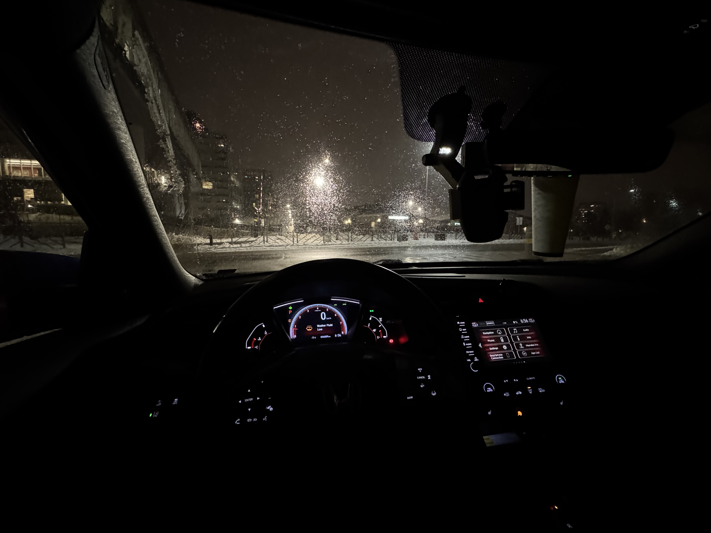

今天是2025年，雪天，毕业论文已经完成46页了，但是不知道为什么就是没有继续工作的欲望，可能是因为这个星期的工作量太大了，我需要休息一下。明天继续吧。

<!-- truncate -->

昨天其实也是效率不高，工作了一天，没啥进展。可能是对于模型已经有点畏难情绪了，既希望能够模型能够训练出来，但是对自己的架构又没啥信心。导致了本该老早完成的模型debug以及训练任务一直没有完成。之后就是在实验室火灾报警。

把我赶出了实验室，无奈只能和马博士一起去Costco买了一点鱼油，水等实验室可能会用上的物品。

不得不说滑铁卢的假警报是真的多，家家户户都有火灾报警器。火灾报警器响的时候也是真的吓人。

昨天有幸开了会马博士的车，操控感是拉满的，果然在加拿大有车的话体验会好很多。如果能有机会，我肯定在大一的时候就考驾照了。然后可以凭借驾驶熟练度，考G1，到加拿大的第一天就租车或买车。可惜今非昔比了，我也要离开这个地方了。现在唯一的希望就是毕业能够顺利一点，论文可以顺利通过。
