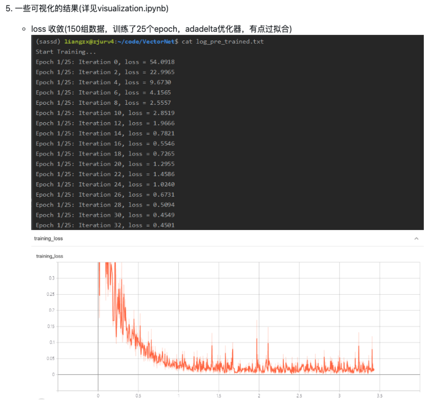

历经了几天时间，总算是把[VectorNet(不严谨版本)](https://github.com/Mafumaful/VectorNet.git)细细全解了一遍。发现了不少bug，但是好在能够跑起来了。

<!-- truncate -->

下面的这个图就是我找的简单版本的声明效果了，可以说收敛性看起来还不错。但是当我动手试的时候，发现收敛性并没有我想象那么好。



自己试的效果如下：

```text
Epoch 50/50: Iteration 200, loss = 0.002727
Epoch 50/50: Iteration 300, loss = 0.003466
Epoch 50/50: Iteration 400, loss = 0.029950
Epoch 50/50: Iteration 500, loss = 0.000649
Epoch 50/50: Iteration 600, loss = 0.027491
Epoch 50/50: Iteration 700, loss = 0.027270
Epoch 50/50: Iteration 800, loss = 0.001796
Epoch 50/50: Iteration 900, loss = 0.002885
...
Epoch 50/50: Iteration 4400, loss = 0.019882
Epoch 50/50: Iteration 4500, loss = 0.003019
Epoch 50/50: Iteration 4600, loss = 0.000351
Epoch 50/50: Iteration 4700, loss = 0.005250
Epoch 50/50: Iteration 4800, loss = 0.003542
Epoch 50/50: Iteration 4900, loss = 0.000445
Save model ./model_ckpt/model_epoch50.pth
Save final model ./model_ckpt/model_final.pth
Finish Training
start time -> 2025-01-11 22:42:24
end time -> 2025-01-12 00:40:00
```

之前使用vectornet网上公开的版本，发现他们都使用了GNN，然后发现项目非但跑不出来，在跑动的时候也是错误百出，会有显卡显存的问题。考虑到实验室显卡并没有达到我预想的要求，于是我决定再看看有没有其他简单版本的实现。

随着更细地检查，我发现这个项目其实还是有很大缺陷的。首先是效果，在第一步迭代之后快速收敛，尽管我在训练的时候训练了五千步，但是依然发现程序在运行的时候收敛性达不到预想的效果。

在我第二次读程序的时候，发现作者似乎只关注一辆车的路径情况，并没有去为其他车辆进行考虑。网络的input只有车辆+maps，导致代码与论文中的网络结构不符。

还有就是绘图的时候用了代码中跑不出来的数据集。好在我还有一整天的时间去debug这个问题。看看能不能成功把他的网络用在我的项目上（微调一段）。
