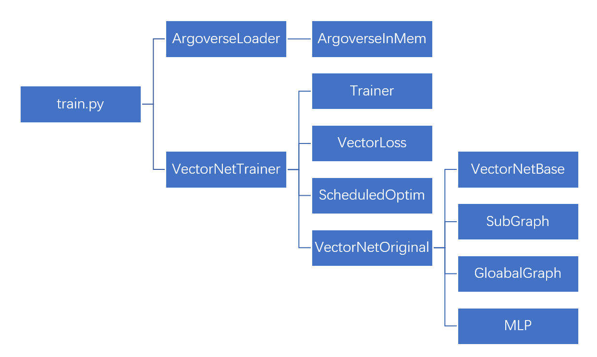

## 参考 

[VectorNet](https://github.com/gah07123/MyVectorNet.git)

个人看了一下这个项目，感觉这个项目并没有真正使用图神经网络，而是使用了传统的MLP, maxpooling等方法。并没有使用到vectornet里面的GNN。它所有的输入都是相同维度的，而且没有考虑到其他车辆与ego vehicle之间的关系。所以我觉得这个项目并不是vectornet的复现，而是一个近似的复现。
<!-- truncate -->

