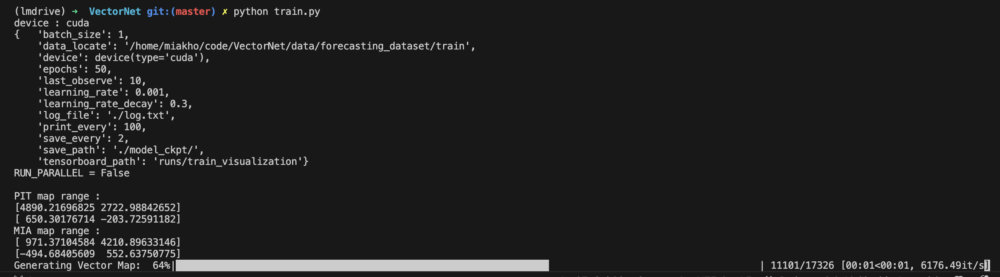

# 程序后台运行 

在使用ssh连接某些软件的时候，如果直接关闭ssh连接，那么软件也会被关闭。如果我们需要对程序进行一些操作，但是又不想让程序在我们关闭ssh连接的时候被关闭，我们可以使用以下的方法。

## 使用nohup命令

这时候可以使用nohup命令，让软件在后台运行。比如说我想在ssh连接中运行一个ping命令，那么可以使用如下命令：

```shell
nohup ping www.baidu.com &
```

如果我们想指定输出文件，可以使用如下命令：

```shell
nohup ping www.baidu.com > ping.log &
```

这样就可以在后台运行ping命令了。如果想要查看后台运行的进程，可以使用如下命令：

```shell
ps -ef | grep ping
```


如果我们需要关闭nohup，可以使用如下命令：

```shell
# 查找进程号
ps -ef | grep ping
# 杀死进程
kill -9 ${进程号}
```

比如说这里的进程号就是`955842`。

## 使用screen命令

screen命令是一个终端复用工具，可以在一个终端窗口中运行多个终端会话。使用screen命令可以在后台运行程序，而且可以在不同的终端窗口中查看程序的运行情况。

### 安装screen

```shell
sudo apt-get install screen
```

### 使用screen

```shell
# 启动screen
screen
# 运行程序
ping www.baidu.com
# 按下Ctrl+A+D，退出screen
```

### 查看screen

```shell
# 查看screen
screen -ls
```

```text
There is a screen on:
        943692.pts-3.miakho-lab-computer        (2025-01-11 10:36:00 PM)        (Detached)
1 Socket in /run/screen/S-miakho.
```

比如说在这里面，screen id 就是`943692`。

### 重新连接screen

```shell
# 重新连接screen
screen -r ${screen_id}
```

### 关闭screen

```shell
# 关闭screen
exit
```

于是我便可以后台运行机器学习了


