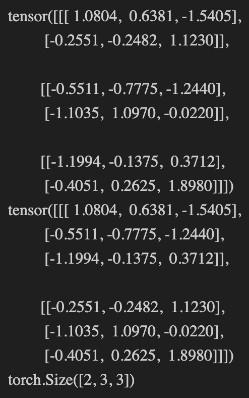

# Tensor

看到市面上有好多说tensor相乘的例子，但是比较停留在书面，无法直观理解张量相乘的过程以及维度怎么判断。这里我用一个例子来说明一下。

## 1. tensor 相乘

```python
tensor1 = torch.tensor(
    [[1, 4],
    [2, 5],
    [3, 6]]
)

tensor2 = torch.tensor(
    [[2, 1],
    [1, 2]]
)

print(torch.matmul(tensor1, tensor2))
```

在这个例子里面，tensor1的维度是 3x2，tensor2的维度是 2x2，那么相乘的结果是 3x2。在这个例子我们把相乘写作(3, 2)*(2, 2)想要满足相乘的条件，`2)*(2`中的2必须相等，那么相乘的结果是(3, 2)。前面的2可以理解为特征，前面的矩阵的特征数量，后面的2可以理解为后面矩阵的特征数量，最后的3可以理解为前面矩阵的样本数量。

## 2. tensor 转置

```python
x = torch.randn(3, 2, 3)
print(x)
x2 = torch.transpose(x, 0, 1)
print(x2)
print(x2.size())
```

结果如下图所示



这里的转置其实是指交换维度，比如这里的x的维度是(3, 2, 3)，那么转置之后的维度是(2, 3, 3)。这里的0和1是指维度的索引，0表示第一个维度，1表示第二个维度，以此类推。在这个例子，我们把最后一个维度看作是一个整体，然后在第0个维度的基础上，去“跳选”第1个维度，这样就得到了转置之后的结果。

所以我是很讨厌传统上的转置的（传统上说矩阵转置的时候会把矩阵描述成沿着对角线将矩阵旋转，但是这个描述在计算机上并不够直观），因为我觉得这样的转置不够直观，所以我更喜欢用交换维度来理解。

再举个例子，下面有一个矩阵

$$
A =
\begin{bmatrix}
1 & 2 & 3 \\
4 & 5 & 6 \\
7 & 8 & 9
\end{bmatrix}
$$

不难知道, 用张量表示A = [[1 2 3], [4 5 6], [7 8 9]]：

$$
A^T =
\begin{bmatrix}
1 & 4 & 7 \\
2 & 5 & 8 \\
3 & 6 & 9
\end{bmatrix}
$$

按照我原来的描述，可以将“转置”的这个过程描述为，我们把第一个维度看作是一个整体，然后在第0个维度的基础上，去“跳选”第1个维度，这样就得到了转置之后的结果。
